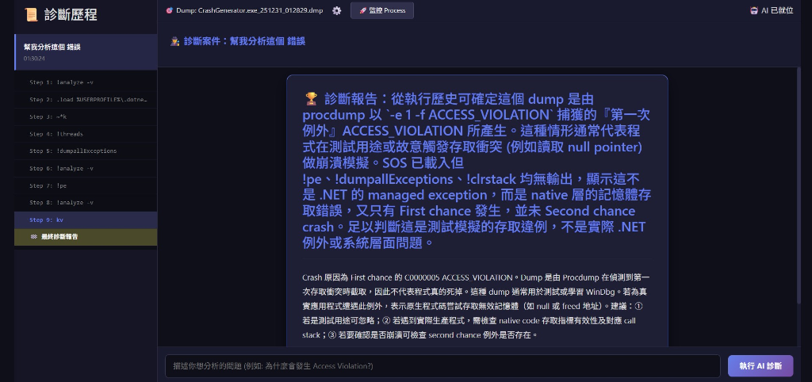

# 🔧 WinDbg Assist

> AI 輔助 WinDbg / Dump 分析工具 - 讓 Production 除錯變簡單。


WinDbg Assist 是一款結合 Azure OpenAI 與 WinDbg (`cdb.exe`) 的自動化診斷工具。它能自主執行連鎖指令，解讀複雜的記憶體 Dump，並產出易於理解的技術報告。

## ✨ 核心功能

- **🤖 AI 自主診斷**：輸入問題（如「為什麼發生 Access Violation?」），AI 會自動執行 `!analyze -v`, `!pe`, `!clrstack` 等多個指令進行連鎖推理。
- **📜 診斷歷程追蹤**：完整記錄 AI 的思考過程 (Thoughts) 與每一個步驟的指令輸出，方便回溯與驗證。
- **📋 傳統工具集**：提供指令助手、輸出解讀與 Stack Trace 分析等輔助功能。
- **🔍 .NET 專精**：優化的 SOS 載入邏輯，完美支援 .NET 10 的託管例外診斷。


*AI 正在自主分析 Access Violation 的當機現場*

## 🛠️ 環境需求

在使用本工具前，請確保你的電腦已安裝以下組件：

1.  **Windows SDK (WinDbg)**：
    *   需要 `cdb.exe` 作為除錯引擎。
    *   預設路徑：`C:\Program Files (x86)\Windows Kits\10\Debuggers\x64\cdb.exe`
2.  **Sysinternals ProcDump**：
    *   用於手動或自動捕捉 Dump 檔案。
    *   請至 [Sysinternals 官網](https://learn.microsoft.com/en-us/sysinternals/downloads/procdump) 下載並解壓縮至你的電腦。
3.  **dotnet-sos**：
    *   用於 .NET 託管程式除錯。請執行：
        ```bash
        dotnet tool install --global dotnet-sos
        dotnet-sos install
        ```
4.  **.NET 10 SDK**。

## 🚀 快速開始

### 1. 設定設定檔

編輯 `appsettings.json`：

```json
{
  "AzureOpenAI": {
    "Endpoint": "https://your-resource.openai.azure.com/",
    "ApiKey": "your-api-key",
    "DeploymentName": "gpt-4o"
  },
  "Debugger": {
    "CdbPath": "C:\\Program Files (x86)\\Windows Kits\\10\\Debuggers\\x64\\cdb.exe",
    "ProcdumpPath": "C:\\Tools\\procdump64.exe"
  }
}
```

### 2. 啟動專案

```bash
dotnet run
```

### 3. 開始診斷

1.  開啟瀏覽器訪問 `http://localhost:5187`。
2.  進入「AI 自主診斷中心」。
3.  點擊右上角 ⚙️ 設定 Dump 檔案路徑。
4.  在下方對話框描述你的問題，開始分析！

## 📝 授權

MIT License
